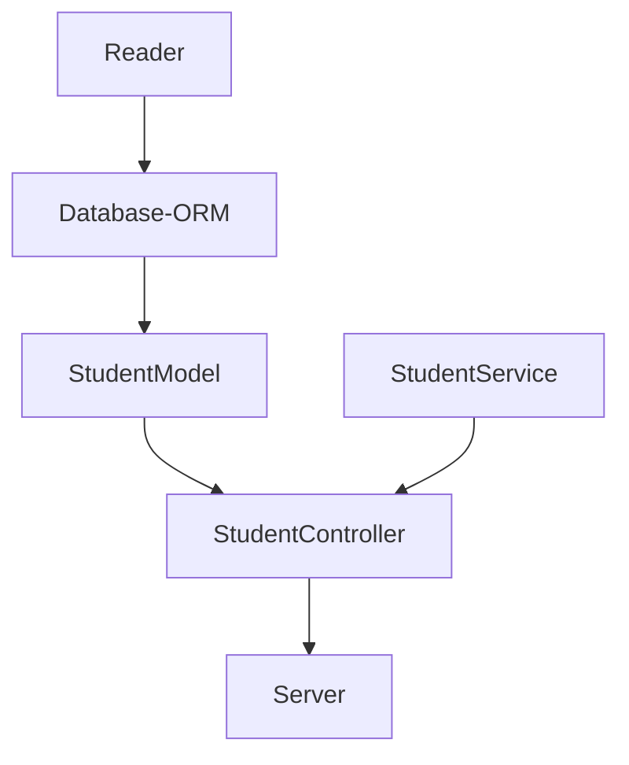

# code_challenge_vt_api
Visual Partner Ship - Cursos

API para consultar la informacion, correo electronico y los creditos de todos los estudiantes

endpoints 

| Endpoint | Request | Response |
|---|---|---|
| `localhost:3000/v1/students` | `localhost:3000/students` | `{"success": true, "message": "", "data":{ "qty": 51, "students": [{"id": "6264d5d89f1df827eb84bb23","name": "Warren","email": "Todd@visualpartnership.xyz","credits": 508,"enrollments": ["Visual Thinking Intermedio","Visual Thinking Avanzado"], ...]}` |
| `localhost:3000/v1/students/with-certification/show/email` | `localhost:3000/v1/students/with-certification/show/email` | `["success": true, "message": "", "data": {"qty": 11, "data":{[{email: "Todd@visualpartnership.xyz"}, ....]}` |
| `localhost:3000/v1/score-greater-than/:score` | `localhost:3000/v1/score_greater_than` | `{"success": true, "message": "", "data":{[{"id": "6264d5d89f1df827eb84bb23","name": "Warren","email": "Todd@visualpartnership.xyz","credits": 508,"enrollments": ["Visual Thinking Intermedio","Visual Thinking Avanzado"], ...]}` |

nota:
nos apegaremos al estricto caso que se nos plantea, sin parametros en el caso de certificacion y el score,
ya que es posible que el cliente, no quiera que se tenga acceso a otra informacion mas que a la que se especifica,
en dado caso que posteriormente el cliente decida acceder a mas informacion, se replanteara la solucion

sugerimos para la respuesta de cada peticion, el formato
```
{
    "success": Bool,
    "message": String,
    "data": array
}
```

# Flujo 



Instalacion
-npm install

Dependencias
- npm install --save express
- npm install --save-dev jest
- npm install --save-dev eslint

configuracion de linter
- npm init @eslint/config

```javascript
module.exports = {
    "env": {
        "browser": true,
        "commonjs": true,
        "es2021": true,
        "jest": true
    },
    "extends": "eslint:recommended",
    "parserOptions": {
        "ecmaVersion": "latest"
    },
    "rules": {
        indent: ["error", 4],
        "linebreak-style": ["error", "unix"],
        quotes: ["error", "double"],
        semi: ["error", "always"]
    }
};
```

Automatizar los comandos de eslint en el package.json
```
  "scripts": {
    "test": "node ./node_modules/.bin/jest",
    "linter": "node ./node_modules/eslint/bin/eslint.js .",
    "linter-fix": "node ./node_modules/eslint/bin/eslint.js . --fix"
  }
```
